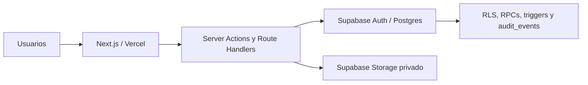

# Arquitectura actual

El navegador usa Supabase sólo con claves públicas. Las mutaciones críticas pasan por Server Actions o handlers y RPCs; el servicio conserva el acceso privilegiado a Storage.

